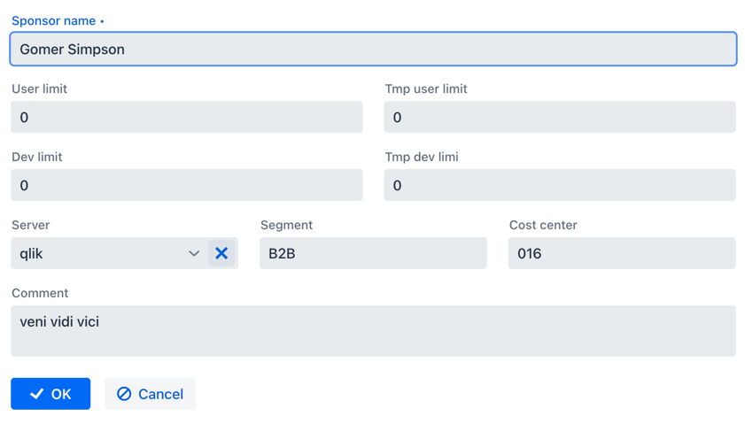
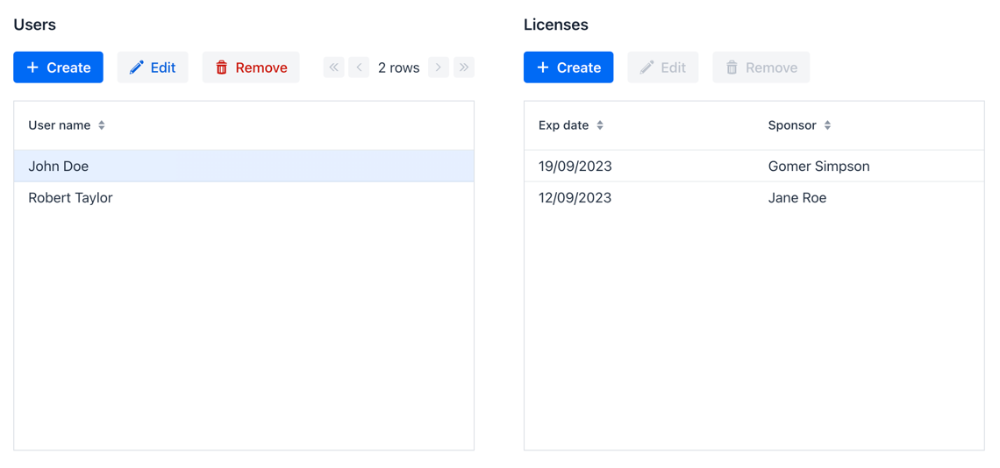

# Jmix Demo

This project contains two non-trivial UI examples.

1. Layout of multiple fields with different widths on a form.

    

   See [qlik-sponsor-detail-view.xml](src/main/resources/com/company/demo/view/qliksponsor/qlik-sponsor-detail-view.xml).

    This form is implemented using the [formLayout](https://docs.jmix.io/jmix/flow-ui/vc/layouts/formLayout.html) layout with 6 columns defined in `responsiveSteps`. For each field, the `colspan` attribute specifies the width in columns: 

    ```
    <formLayout id="form" dataContainer="qlikSponsorDc">
        <textField id="sponsorNameField" ... colspan="6"/>
        <textField id="userLimitField" ... colspan="3"/>
        ...
        <responsiveSteps>
            <responsiveStep minWidth="0em" columns="1"/>
            <responsiveStep minWidth="50em" columns="6"/>
        </responsiveSteps>
    ```
   
2. Master-detail list.

    

    See [qlik-user-list-view.xml](src/main/resources/com/company/demo/view/qlikuser/qlik-user-list-view.xml).

    The view displays the list of Qlik users and the list of licenses for the selected user.

    The lists are linked using the query with a parameter and the [dataLoadCoordinator](https://docs.jmix.io/jmix/flow-ui/facets/dataLoadCoordinator.html) facet:

    ```
    <data readOnly="true">
        <collection id="qlikUsersDc" ...>
            <loader id="qlikUsersDl">
                <query>
                    <![CDATA[select e from QlikUser e]]>
                </query>
            </loader>
        </collection>
        <collection id="qlikLicensesDc" ...>
            <loader id="qlikLicensesDl">
                <query>
                    <![CDATA[select e from QlikLicense e
                    where e.user = :container_qlikUsersDc  ]]>
                </query>
            </loader>
        </collection>
    </data>
    <facets>
        <dataLoadCoordinator auto="true"/>
    ```
   
    In the [QlikUserListView.java](src%2Fmain%2Fjava%2Fcom%2Fcompany%2Fdemo%2Fview%2Fqlikuser%2FQlikUserListView.java) controller, the license "create" action is made available depending of user selection, and  a new license is initialized with the selected user and current time.
